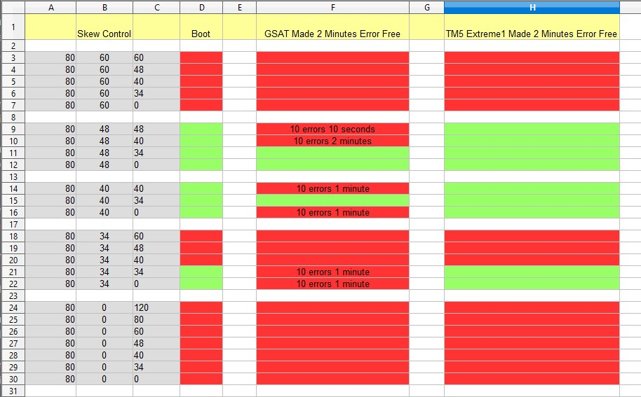

For now, this document is a mix of findings, tips, notes, and advice for overclocking memory.

These writings are specifically for **DDR4 B-die on Intel**. YMMV with other memory types.

I hope to eventually turn this document into a full-fledged guide. For now, feel free to skim through it and take whatever you find useful with you. 

If you found this guide useful, feel free to leave a Github Star ⭐, it really helps motivate me to write more :-)

Basic Memory Overclocking
====================

Steps from start to finish
-------------

The following overall process is based on this [comment with an order of which timings to optimize when](https://github.com/integralfx/MemTestHelper/issues/87#issuecomment-2119254780). Make sure you run extensive memory testing (i.e., several hours) every time you change settings, so that you will know exactly what's causing issues at any point in time. 

First some preliminary steps:
- turn **PowerDown mode off** before you start
- turn **Memory Fast Boot off** (or set it to Slow Training on MSI) while overclocking
- revert your processor **core/cache overclock** to safe values while working on memory overclocking[^processorOC]
- export a **backup of your BIOS settings** to a USB, and keep backing up your updated profile as you make progress and tighten timings

[^processorOC]: this ensures your core/cache clocks and/or voltage won't be the limiting factor for your memory OC. Sometimes, a processor core/cache overclock that is otherwise stable may need to have its voltage raised a slight bit after applying a RAM OC. To avoid the confusion of this scenario, it is easier to just revert the core and cache to safe, conservative speeds while working on your RAM overclock, then reapplying your OC once your memory is stable, adding a few tens of milivolts to your core if needed at that point.

Next, find out which **frequency** to aim for:
- raise your primary timings to tCL=20, tRCD=20, tRAS=46 before you raise frequency so that tCL will not limit how high you can go
- also lock down tRDRD=tWRWR=8; tWRRDs to 16-16; and tRRDs to 6-6 before you proceed. Otherwise I've seen some BIOSes raise these to unacceptable heights to compensate for higher frequencies, making you think such a frequency is OK when it's really not.
- now see how far up in frequency your memory will go with Command Rate set to 2.
- then see how far up in frequency your memory will go on CR1. If on Asus, turn on trace centering before testing. If you're on a 4-DIMM board/setup, it's normal that high frequency CR1 is very hard.
- next, choose CR1 or CR2 depending on your results, prioritizing CR2 if it's 200+ MT/s higher than CR1 as a basic rule of thumb

Having settled on a frequency, we move on to the **most impactful timings**:
- lower tRRDS/L + tFAW as it speeds up memory testing and is largely independent from all the other parameters. 4-4-16 is usually a safe, performant choice for these
- tCL should be tightened next, then kept at that fixed value for the rest of this process[^tCL]
- find good RTL/IOLs and lock them. These depend on frequency and tCL.
    - if you cannot train good RTLs/IOLs, optimize your ODT RTT skews to fix this
- lower tRCD/tRP
- set tRAS=tCL+tRCD+6 or +4. Note that lowering tRAS below this point usually lowers performance, so run extensive benchmarks if you insist on trying this.

[^tCL]: how far you can take many of the following timings will depend on your setting of tCL and would therefore have to be tightened again if you changed tCL. That's why you'll want to find the tightest stable value for tCL at your chosen frequency as one of the first things you do.

At this point you've locked down the main timings, but there's a few more gains to be had - mostly when it comes to loaded latency:
- lower tWR/tRTP together, keeping tWR at twice the value of tRTP
- lower tCWL; this goes after tCL since tCWL depends on it 
- after tCWL is tightened, lower tWRRD-sg/dg. Note that tCWL and tWRRD are inter-dependent: tightening one makes it harder to tighten the other.
- lower tRDRD and tWRWR
- Finally, tRFC, tREFI can be optimized here, but doing them at earlier points works fine too. Note that they are very temperature sensitive, so stress test your GPU while testing RAM to raise chassis temperature to a realistic one (unless you have your GPU/RAM watercooled). These two timings are crucial for latency, which is what matters for 1% FPS lows in gaming.

You can then stop here if you're satisfied, or try advanced techniques documented below if you want to take your OC further

- TODO further document order of which advanced parameters to optimize, like RTLs-IOLs first, slopes near-last..

Stability testing
-----
TODO write me.

Stability testing tools
-----------------

- [GSAT](https://github.com/stressapptest/stressapptest) is among the best tools for stability testing. You can run it on Windows via WSL.
- TestMem5 (TM5) with [these configs](https://github.com/integralfx/MemTestHelper/tree/oc-guide/TM5-Configs). TM5 can sometimes find errors in minutes that other tools take hours to discover. At other times TM5 finds nothing for an hour, and then VST errors after five seconds. Thus it's worth running as a supplement to other tools, to quickly find some types of errors.
- [y-cruncher](http://www.numberworld.org/y-cruncher/)
  - The VST, VT3 and FFT stress tests are excellent for testing stability.
  - Y-cruncher's Pi calculation can be timed as a good benchmark. It is sensitive to most memory changes, including loaded latency.

(TODO write about which tools stress what, IMC vs. RAM timings etc.)

Benchmarking tools
-----------------

- [Intel Memory Latency Checker (MLC.exe)](https://www.intel.com/content/www/us/en/developer/articles/tool/intelr-memory-latency-checker.html) is good for measuring latency and bandwidth
- PyPrime is a good, latency-sensitive benchmark

Other useful tools
-----------------
- Asrock Timing Configurator is a useful tool for showing your current timings. It works on any boards, not just Asrock.
- On ASUS, the MemTweakIt tool is also very useful; it serves the same purpose as Asrock Timing Configurator, but further allows real-time timing changes.

More advanced topics
====================

About Memory Training
-------------------
Each time you boot your computer, it goes through a process known as memory training. During memory training, your system goes through a long lineup of algorithms to tune timings and parameters that are specific to your memory, motherboard, processor, and even the current heat level of your RAM sticks. This training must complete before your system can use its RAM. 

Thus memory training occurs in the time between when you press the power button and the time when you are able to enter your BIOS. If your motherboard has a [seven-segment display](https://i.ytimg.com/vi/bEjH775UeNg/maxresdefault.jpg) with numeric codes, you can follow along as it trains. Sadly only expensive motherboards have this feature nowadays.

You can find a list of memory training algorithms inside your BIOS's advanced settings, where you can enable or disable individual algorithms. 

  
Example List of Memory Training Algorithms

<code>
Early Command Training 
SenseAmp Offset Training 
Early ReadMPR Timing Centering 2D 
Read MPR Training 
Receive Enable Training 
Jedec Write Leveling 
Early Write Time Centering 2D 
Early Write Drive Strength / Equalization
Early Read Time Centering 2D 
Write Timing Centering 1D 
Write Voltage Centering 1D 
Read Timing Centering 1D 
Dimm ODT Training* 
DIMM RON Training* 
Write Drive Strength/Equalization 2D* 
Write Slew Rate Training* 
Read ODT Training* 
Read Equalization Training* 
Read Amplifier Training* 
Write Timing Centering 2D 
Read Timing Centering 2D 
Command Voltage Centering 
Write Voltage Centering 2D 
Read Voltage Centering 2D 
Late Command Training 
Round Trip Latency 
Turn Around Timing Training 
Rank Margin Tool 
Memory Test 
DIMM SPD Alias Test 
Receive Enable Centering 1D 
Retrain Margin Check 
Write Drive Strength Up/Dn independently 
CMD Slew Rate Training 
CMD Drive Strength and Tx Equalization 
Cmd Normalization
</code>

Some terminology: when POSTing and going through memory training, if the motherboard manages to choose parameters that have your RAM stable and error-free, we say that your memory "trained well". Otherwise we call it a "bad training".

A common situation in RAM overclocking is that one boot, your system is rock solid and stable.. and then the next boot you get tons of memory errors and crashes. 

Knowing about memory training is useful because it can explain what's going on in this situation: your memory trained well the first time, and poorly the second. To stabilize the system, you will need to find settings that consistently train well.

If you enable "fast boot" under your BIOS, the old training will be saved and reused on each boot. You generally want to **turn fast boot off** when you are RAM overclocking to avoid confusion and ensure stability. This way you get to see many different trainings of your memory as you reboot, and you can confirm that all of them are stable.

Even with fast boot enabled, if your system crashes, it will re-train memory on the next boot. You can tell this is happening as the boot takes far longer than usual.

Memory training and variance across reboots
-----------------------------------
Understanding memory training can help explain how a system can be stable one day, while crashing and BSOD'ing the next day.

On each boot, your motherboard trains its memory anew.[^memtrainanew] This involves running a long list of algorithms to determine values for various parameters, resistances, and hidden timings, all of which can affect memory stability. As you increase your overclock, it gets more difficult for this memory training to consistently succeed. Additionally, the training results vary depending on DIMM temperature, voltages, and a whole host of other, essentially random factors. 

If you want to be sure that your overclock is stable, you will need to do multiple reboots, and run stability tests each time. In general, the hardest test to 'pass' is where you fully power down your PC and turn off your PSU, then hold down the power button for 10-30 seconds. Then power up your system as usual. In this scenario, memory training is most likely to go wrong, revealing instabilities. We call this a 'cold boot with PSU off'.

In my experience, this trick is **very fast** at finding instabilities in your memory overclock. In fact, a few cold boots with the PSU off, running just a few minutes of memory tests in each boot, is way more likely to find instability in your OC compared to running tests for hours and hours, all on a single boot.

The idea that your motherboard trains memory on each boot also means that some boots can have higher error rates than others. That is, there can be a big variance in stability across trainings, even without any settings changing. This is crucial to know about for some of the more advanced topics, like finding optimal voltages and ODT RTTs for your setup.

[^memtrainanew]: At least, memory is trained every boot if you have 'Memory Fast Boot' disabled in the BIOS. Otherwise, the setting helps your PC boot faster by reusing its old memory training values on new boots. You'll want to turn this setting **off** while overclocking to get a clearer picture of the current state of your system.

RTLs and IOLs
-------
RTLs and IOLs are values that get set on each boot. You will want to find good values for them and set them to these fixed values inside the BIOS. This way, your board trains those RTLs and IOLs on every boot. This decreases variance and increases stability.

Additionally, RTLs and IOLs, when left on auto, can sometimes provide a hint about whether your memory training was good or bad.

- If RTLs are more than two apart, or IOLs are more than one apart across channels, then it is likely a bad memory training.
  - Note that this is only a rule of thumb, to be used for quick sanity checks.
  - Some online discussions talk about this as an absolute rule, but I have seen plenty of exceptions
- format: `RTL CHA` - `RTL CHB` - `IOL CHA` - `IOL CHB`
- example: 56-57-6-7 is a comparatively "good" training, because the RTLs 56 and 57 are only 1 apart, and the IOLs 6 and 7 are only 1 apart as well.
- example: 56-58-6-8 is unlikely to be stable by our rule of thumb, because the IOLs 6 and 8 are two apart.
- TODO talk about locking them in, and difference across manufacturers.
- ODT RTTs are strongly related to how well your RTLs and IOLs train
- When RTLs and IOLs won't train consistently well, it's likely because your RTTs are suboptimal
- RTLs vary by tCL. Raising tCL by one will require raising all RTLs by two.
- Higher memory frequencies may require slightly higher RTLs. For example:
  - at 4200 MHz my board likes 56-56-7-7
  - at 4300 MHz, it prefers 56-57-6-7 for stability
  - at 4400 MHz, 57-57-7-7 seems ideal.

ODT RTTs
-------------

RTTs (Termination Resistances) are the values for Nom, Wr, Park that can be manually set in your BIOS for each memory channel. They strongly affect stability at higher frequencies. Setting correct values for them is crucial in order for your DIMM's ODT (On-Die Termination) to work well. This ensures signal stability even at high frequencies, letting you OC your sticks much further.

- Setting ODT RTTs (Wr, Nom, Park) correctly will *massively* impact how far you can take your OC
- Many cheap boards can actually OC surprisingly well once you set ODT RTTs, they just set bad values on Auto!
- ODT RTTs can be found under the Skews menu in the Asus BIOS, and are also known as ODT Skews.

Here's a very [clear explanation of RTTs](https://www.overclock.net/posts/28906340/) by @7empe, lightly edited for clarity:

> RTTs refer to the resistance of the on-die termination points. [They are needed because] high frequency signals are unfortunately prone to reflections that happen when a signal hits a point of different resistance on its path [i.e., when the signal jumps from one material to another]. More reflections = more signal distortions = more difficult to stabilize the memory OC. RTTs are quite motherboard specific. Also IMC quality and RAM frequency matters due to the above. RTTs [are not] timings, therefore [lower values] are not better. [What's best] is what gives you constant stability for a given RAM OC. For me 80-40-48 works the best (WR-NOM-PARK) but it does it mean that this will work for you. However this seems to be a good starting point for both 4-dimm and 2-dimm motherboards.

Background info on ODT RTTs
-----------------------------

- The unit for RTT is Ohms. The RTTs are resistances.
- Nom is short for Nominal[^polarfire]
- Wr is short for Write; it is the termination resistance used during a write operation
- Park is a default, or "parked" value when nothing else is going on[^samsung]
- see also https://en.wikipedia.org/wiki/On-die_termination

[^polarfire]: https://microchip.my.site.com/s/article/Use-of-the--ODT-Rtt-Nominal-Value--and--Dynamic-ODT--Rtt-WR---parameters-in-the-PolarFire-DDR-memory-controller
[^samsung]: https://download.semiconductor.samsung.com/resources/device-operation-timing-diagram/DDR4_Device_Operations_Rev11_Oct_14-0.pdf

Setting the RTTs in practice
-------------

- Optimal values can vary depending on other variables
  - IO voltage, RAM voltage, frequency, and CAS latency affect optimal ODTs. There are likely more variables too.

Optimal RTTs depend on your memory frequency, but the max frequency you can reach also depends on having set at least "good enough" RTTs! This creates a catch-22 situation when you want to find out which memory frequency to settle for in your RAM OC. Therefore, you may have to iterate a few times: 
- raise frequency as far as it will go with ODTs on auto
- then optimize your ODT RTTs
- finding better values than your board's auto settings will let you increase frequency further
- now you can improve your ODT RTTs again at the new frequency
- repeat until you are unable to raise frequency further

Each of the variables Wr, Nom and Park can only take specific values: 0, 34, 40, 48, 60, 80, 120, 240, 255. So you cannot set, for example, Wr=94. Only Wr=80 or Wr=120.[^msitune]

[^msitune]: In MSI BIOS you can fine-tune ODT RTTs, though. This is likely not worth fiddling with until much later in the overclocking process.

A starting point for ODT RTTs
-------------

Which values should you use? If you haven't played with RTTs before, try a few of these settings as a starting point; they're in MSI format (wr-nom-park):
- 80-34-48
- 80-40-60
- 80-0-34
- 80-0-60

To simplify things, keep ODTs the same for channels A and B initially. You can fine-tune them one channel at a time later on.

Try the above suggestions one at a time and see if setting that Wr-Nom-Park triplet lets you POST at a higher frequency than on Auto. Once you find good candidate Wr-Nom-Park values, test each triplet for multiple reboots to ensure the setting consistently trains and POSTs. 

This gives you a starting point with fixed, manually set values. Past this point you can then pick one of Wr, Park, and Nom, and move it up/down by one, then see if your system got more stable.

Manually optimizing ODT RTTs
-------------

I used Google Translate from a .ru forum to find this method from anta777:

    I am posting my method for selecting RTT.

    We set the voltage and primary timings according to the xmp of our memory, RRDS=4,RRDL=6,FAW=16, monitor the CWL (with even CL=CWL, with odd CL-1 (better) or CL+1 (worse), there are boards who love odd CWL.

    Or we take the already selected voltage and frequency with our stable timings.

    Then we test with GSAT for 3 minutes, we do all this on the resistances that our motherboard has installed.

    If there are no errors, then lower the voltage to the memory by 10 mV until errors appear in the GSAT test

    [Once we get] errors, we begin to select the best resistances.
  

    There are 3 types of resistances for DDR4 memory sticks:

    RTT Wr
    RTT Park
    RTT Nom

    In the BIOS of Asus boards they are in this order, for MSI they are in a different order: Wr, Nom, Park.

    RTT Wr according to Jedec can be only 240/120/80.

    RTT Park and RTT Nom - 240/120/80/48/40/34/0.

    0 is not advisable to use for high frequencies, since this reduces the possibility of stable operation of memory sticks.

    We take into account that Rtt Wr>=Rtt Park>=Rtt Nom.

    We check all possible options, writing down the number of errors found in GSAT for each option.

    We start searching with 80/60/60.

    There are 14 options in total, and without 0 there are even fewer (10 options).

    Need to test:

    80/60/60
    80/60/48
    80/60/40
    80/60/34
    80/60/0
    80/48/48
    80/48/40
    80/48/34
    80/48/0
    80/ 40/40
    80/40/34
    80/40/0
    80/34/34
    80/34/0

    Sometimes you need to start with 120/80/80.

    In this way we find the option with the least number of errors.

    If several options give 0 or the same number of errors, then we lower the voltage by another 5 mV and test these options. If you don’t find a difference, then it’s better to take the option with lower resistance.

    After finding the best option, set these resistances in the BIOS, then look for the minimum voltage at which there will be no errors in GSAT, raising 10 mV each.
  
    When we found it, we can immediately safely raise it by another 10 mV and begin testing in Windows using testmem5 with a universal config.

In my experience, you **cannot** safely assume that `Rtt Wr >= Rtt Park >= Rtt Nom` if you want to find truly optimal values. I have seen too many counter-examples at this point, where having `Park < Nom` results in higher stability.

You should also check each setting for 3+ reboots to ensure it trains consistently, at least once you have narrowed down your options.

Make sure to also read [The importance of skew control for memory overclocking](https://overclock.net/threads/the-importance-of-skew-control-for-memory-overclocking.1774358/). In that thread, @munternet from overclock.net explains how he found optimal ODT RTT values:

    I spent the day testing different settings to see just how much difference the skew settings make and it seems it won't even boot with many of them
    
    I can see now that it would be easy to think you were unlucky in the silicon lottery or your IMC isn't any good just because your skews aren't set correctly
    
    The 2 tests I'm using for stability are:
    
        TestMem5 extreme@anta777
        GSAT
    
    I only did 2 minutes each initially as there was a lot of testing to do and the aim was to narrow down the possible final contestants
    
    So my first step was to find a setting I knew to be not quite stable
    5.2/49 1.32v LLC7
    4533-18-19-19-36
    1.45vdimm
    1.35vccio
    1.35vccsa

    Next it was just a matter of going through all the possible combinations that booted and the ones around them and running the tests
    [In the image below] are the results.

    These results laid out in this manner make it pretty clear what my optimum options are for this hardware
    You can clearly see that GSAT has a much smaller range of acceptance.

    You may find that you can boot a much higher ram overclock once you have done this.

Keeping a spreadsheet like the above is extremely helpful when optimizing ODT RTTs, and any other values that require extensive testing. I like to use Google Sheets for it.

Another approach by @Ichirou from overclock.net is quoted here. He describes how to find a more advanced setting (Bitline Slopes) but the approach is useful for ODT RTTs too:

    I've found a much better approach to take for these slopes, which is much easier and faster.
    Take your most stable config, and pull down VDIMM by a little bit (so that it is unstable, but can still boot to desktop).
    
    Afterwards, instead of doing each group in pairs, do them individually by leaving the other on Auto. The rising is more important than the falling.
    Pay close attention to how well your PC boots. If the value is stable enough, it will boot to the desktop.
    If it's only somewhat stable, you might experience only partially booting, or taking a while before it BSODs, etc.
    If you can't even boot, or if it instantly BSODs on load, that means that value is worse compared to the last one you tested.
    
    Take notes and essentially knock off each value one by one. Once you have one side (rising) figured out, the other side should be much easier
    Booting to the desktop is already quite the feat once you reduce your VDIMM. That's long before GSAT even matters.
    You'll likely find that only specific values will let you reach the desktop, while the rest just gets stuck on load.
    It's best not to lock in values for other groups too soon, as some can collide with other groups. You will want to find all potential values per group first.
    
    Of course, you should obviously lock in your RTTs first as well as your ODTs.
    RTTs kind of involve a bit of field testing, but usually the WRs will be 80, which already narrows down your options. And NOM and PARK tend to be at most 120.
    The ODTs are revealed on MSI boards, but might not be on others (like ASUS).
    
    You can use the same method here to figure out the ODTs. Find [an unstable] config, Auto all but one ODT value, and gradually raise it from 0 until it's stable.

So in essence, you can optimize a single setting out of Wr/Park/Nom at a time by doing the following:

- set all your ODT RTT values on Auto
- introduce slight memory instability
- raise your setting from 0 up to its maximum, trying all different values for it
- if one of these causes stability, note it down
- repeat with other settings

A small but very **useful tip** I figured out: it's best to optimize ODTs for Channels A and B independently, one at a time, for much clearer results. Use a BIOS option to disable the other channel, or simply physically remove the DIMM from its slot. This way, bad ODTs from Channel B won't cause instability, muddying up the data while you are trying to find optimal ODTs for Channel A, and vice versa.

Other notes on ODT RTTs
-------------
- when your RTLs and IOLs fail to train well on auto, it's usually because your ODT RTTs are wrong (or you set a timing too tight)
- if your RTLs/IOLs only go very high/bad on one channel, but not the other, it's a strong hint that your RTTs for that channel are wrong!
  - for example, if your auto training often lands on 57-64-7-14, rather than around 57-57-7-7, then the high numbers are on Channel B, and you could try tweaking CHB ODT RTTs a bit up or down to see if that helps.
  - Tweak one of Park/Nom at a time, moving it one step up or down. Then do 3-5 reboots and see if your RTLs and IOLs on Auto become better.
  - If you just changed frequency and your skews no longer fit, it can be useful to switch one of ChA/ChB Park/Nom to Auto, then back again. Do all four parameters one at a time to identify which one is wrong. 
- Wr is usually fixed at 80. At very high frequencies (4500+) it can sometimes be better at 120.
- Asus and MSI use a different order for these, making it easy to get confused!
  - Asus uses the order Wr-Park-Nom
  - MSI uses the order Wr-Nom-Park
- when communicating with others, try to use explicit, unambiguous notation
  - for example, write: wr=80, park=0, nom=60. This is clearer than writing 80-0-60, whose meaning depends on the relevant board manufacturer
- you can get a quick feeling for approximate RTT values by setting your IOLs and RTLs all on auto and rebooting a few times, then seeing whether the RTLs/IOLs train well
- About scaling: as you increase demands on your memory controller (e.g. setting higher frequency, lower CAS latency) then the optimal values will change.
  - Wr usually remains static at 80; very high frequencies may benefit from wr=120
  - Nom drops slightly (e.g., 80-40-40 optimal at 4200C15, 80-40-34 optimal at 4300C15)
  - (Previously I found that Park drops towards 0 and Nom increases towards Wr, but I cannot replicate this, perhaps due to using different sticks?)
- it is very possible that memory channels A and B prefer slightly different RTTs.
  - for example, CHA might prefer 80-0-48 while CHB should be 80-0-60 for optimal stability.
  - Start by optimizing both channels together, changing values for both channels at once. Then finish the process by tweaking the RTTs slightly up and down one channel at a time, to look for better values.
- You cannot generally assume that Wr, Nom and Park are independent and optimize each one at a time
   - however on some boards the assumption may hold and be a useful shortcut

Other tips for data collection: 
----------------------

- you will need to temporarily cause instability
    - e.g. by pulling down VDIMM/VCCSA a bit until you get errors
    - you can also deliberately over-tighten timings as a way to introduce errors
- collect error rates over time
- use GSAT; anything else I tried gave inconsistent results and muddy data
    - I've tried TM5, Y-cruncher Pi, VST, VT3, FFT, N64, Linpack, memtest86, memtestpro
    - no other tool gave as consistent and high error rates as GSAT
- collect data across multiple boots for each setting
    - otherwise training variance will make you believe you've found a better setting, but it's just training variance
- you want as high error rates as possible while comparing settings, as this gives statistical significance sooner!
    - you do need to keep error rates low enough to avoid freezes, however
- always test inter-run variance before optimizing!
- TODO document this.
- custom OS installation that runs a test, saves data to storage, then auto reboots -- this is great for collecting data!
- On ASUS, disable Memory Scrambler while optimizing, then re-enable it once you want stability.
    - Otherwise errors become inconsistent and it is hard to spot the patterns in your collected data

Misc findings
-----------
- ODT Write Duration and ODT Write Delay are independent of each other
  - This means you can optimize one of them first while the other is on auto, then lock your found value and search for the remaining part of the pair. This will discover the optimal values; there is no need to check every pair combined.
- The MSI Memory Try It! feature changes various settings behind the scenes, for example enabling or disabling some training algorithms that are set to Auto. Therefore it's worth testing different values of this feature, even if you override all the timings it sets for you.

Tweaking memory training algorithms
--------------------------

You can sometimes find stability gains by moving specific trainings from 'Auto' to enabled/disabled.

The algorithms "Early Command Training" and "Late Command Training" are inter-dependent. You usually want to ensure only one of them is enabled at a time. Around 3200-4000 MHz, having only Early training enabled gives the best results. Once you push your RAM past a certain point, around CL16-CL17 and/or 4200 MHz, then disabling Early training and enabling only Late training gives better results.

Turn Around Timing Training: unless you disable this, some of your secondary timings may surreptitiously get changed across boots. Your settings for secondaries will only be taken as guidelines. I recommend always disabling this.

The 2D Centering and/or Voltage Centering trainings have been useful for me, but only in four-DIMM setups.

The first algorithms up to around Jedec Write Leveling are usually required to be Enabled in order to boot.

The "Early" versions of trainings are linked with the normal, non-early versions. I believe only one of the normal/early variants needs to run. For example, on MSI, enabling "Early Write Time Centering 2D" will implicitly disable "Write Time Centering 2D", assuming it is on Auto -- and vice versa. 

I recommend testing each one of these, as I have had stability gains with them, but not many of the others:
- Early/Late Command Training (see above)
- Round Trip Latency: **Enabled**
- Turn Around Timing Training: **Disabled**
- Memory Test Training: **Disabled**
- 

DLL Bandwidth setting
---------------------

On MSI z490, I found that the Auto setting was consistently far more stable than any manually set bandwidth setting! Perhaps on auto, the board uses some mechanism to find a finely tuned value, whereas choosing 0/1/2/.../7 simply corresponds to specific values found in a lookup table?

On Asus, I've found that this setting is worth optimizing for small stability gains. For me, the ideal value could be found in the interval between 0 and 2. This value outperformed the 'Auto' setting, unlike on MSI.

The optimal value likely depends on DRAM frequency.

Note that changing DllBwEn requires a cold reboot for the change to be applied at all! If it seems like all the values you try for it just give similar results, this is likely the issue.

A word of caution when learning RAM OC
----------

Usually when I google any other software/hardware topic looking for advice, I'll get mostly correct information. Even a closely related topic, CPU overclocking, has plenty of good info readily available.

But for some reason, when it comes to RAM OC, the water's muddy. It's way muddier than you might think at first.

I don't think anyone's out to mislead or cause confusion. People share information with an intention to be helpful. It's just that "the truth" within RAM OC can vary greatly from system to system, and is further obscured by statistical noise and variance across reboots.

To be fully certain about any claim that 'this setting helps with stability' is **really hard**. You need to gather data via long stability tests across multiple reboots. Then, analyze the collected data to ensure statistical significance when it comes to the error rate being different after your tweak. Only then do you have a reasonable level of certainty that your conclusion is correct -- at least for your particular system, with that combination of components, at the given voltages and temperatures. 

While this level of rigor may be excessive for most other topics, it seems necessary to achieve exceptional results in memory overclocking.

Most people casually making claims on the internet have _not_ gone through this level of rigorous data collection and analysis. Therefore, take all claims you read online about RAM overclocking with a huge grain of salt.[^overconfident]

[^overconfident]: A small rant: be especially wary if someone thinks they can tell you exactly which voltages and sub-timings you need to set, just by applying their "universal formulas". For some reason, this is something I often see coming from the Russian community? In reality, there's few universal rules when it comes to memory overclocking. Formulas for e.g. tRAS as a function of tCL and tRCD can be a fine **starting point**, but optimal values will depend on your board manufacturer, IMC, Intel vs. AMD, chipset generation, cooling situation, voltages, and a whole lot of other factors. The only way you'll know your true optimum is by doing the benchmarking and stability testing yourself.

So rather than reading _everything you can_ on RAM OC, I've found it **far** more effective to keep a small, curated list of people who have gotten strong results. Read their advice and ignore the rest. 

People who give useful advice
-------------------------------

Here's my own list of people whose advice I've had success following. In no particular order:
- [OLDFATSHEEP](https://www.overclock.net/members/oldfatsheep.631030/)
- [7empe](https://www.overclock.net/members/7empe.641121/)
- Falkentyne [ocn](https://www.overclock.net/members/falkentyne.54143/), [reddit](https://www.reddit.com/user/falkentyne)
- [Ichirou](https://www.overclock.net/members/ichirou.258305/)
- [PhoenixMDA](https://www.google.com/search?q=site%3Aoverclock.net+%22PhoenixMDA%22)
- [capn223](https://www.reddit.com/user/capn233)
- [Noreng](https://www.reddit.com/user/Noreng)

Automation and tricks to save effort
----------------------------------
- TODO write me

Interesting quotes
------------------

> [warm restart] causes post error 55. To avoid it I need to set Maximus Tweak Mode to 1 (from 2) and avoid fixing tRDRD_sg_training, tRDRD_sg_runtime, tRDRD_dg_training, tRDRD_dg_training. These have to be on auto, even with having the same 7 - 4 values after training. Setting them to fixed 7 - 4 gives me always post code 55 no matter how ridiculous VCCSA I would apply -- 7empe

Links
---------------
- [Perfect's RAM OC Guide](https://docs.google.com/document/d/15qsrwUxGbKtqjeyEhmCear2kN9hCt2noKK5z14Webhg/edit?pli=1)
- [Integralfx's DDR4 OC guide](https://github.com/integralfx/MemTestHelper/blob/oc-guide/DDR4%20OC%20Guide.md)

TODO and reminders
---------
- TODO idea: put stars out of five, indicating difficulty/advancedness, and potential gains from tweaking
- talk about cold vs. warm boot, full powerdown with power supply off, boot stability
- write about stability testing, its importance, which tools work well
- 

Disclaimers
-----------
- I have only tested this information on B-die
- I have only used Intel systems
- I have only looked at DDR4
- I have only look at Asus and MSI boards so far

